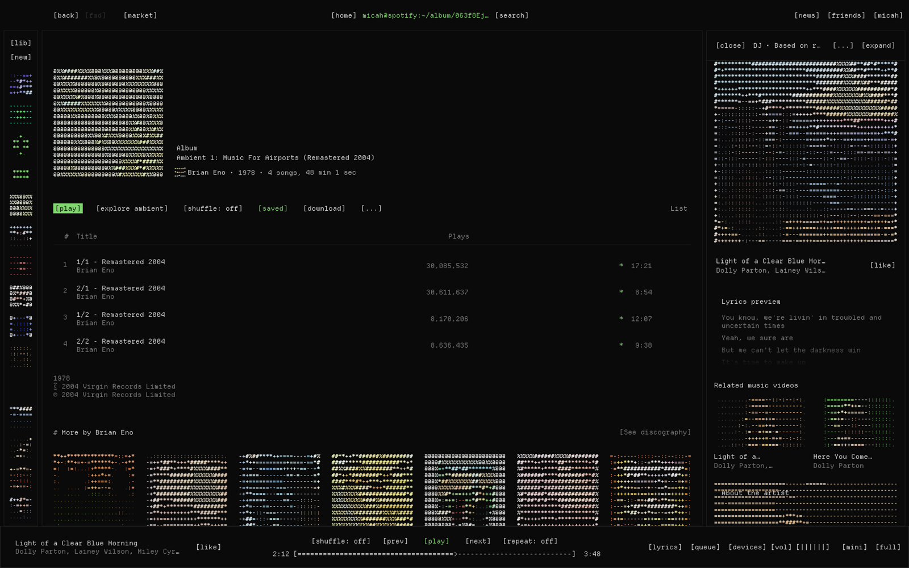

# ber-cli

Spotify as a terminal, set in Departure Mono.



- One face, one size. Headings are never bigger than anything else.
- Square boxes, one signal colour, eleven schemes.
- Every cover, artist photo and Canvas loop is redrawn in coloured characters.
- Every icon is a word: `[prev] [play] [next] [shuffle: off] [repeat: off]`.
- Progress and volume are text bars: `[========>-----------]`.
- The search box is a prompt that knows where you are: `you@spotify:~/collection/tracks$`.
- The miniplayer gets the same treatment.

## Font

ber-cli is set in [Departure Mono](https://departuremono.com) by Helena Zhang,
bundled in `assets/fonts/` under the SIL Open Font License 1.1 (`assets/fonts/OFL.txt`).
It has one weight, so headings are the same weight as everything else, as in a terminal.

## Install

From the Spicetify Marketplace: Themes, search "ber-cli".

Or by hand:

```sh
git clone https://github.com/mkeawe/ber-cli ~/.config/spicetify/Themes/ber-cli
spicetify config current_theme ber-cli color_scheme Ek inject_theme_js 1 overwrite_assets 1
spicetify apply
```

`overwrite_assets 1` copies the bundled font into Spotify. Without it, theme.js
fetches the same file from this repo.

Schemes: `beebee`, `cloud`, `Ek`, `highway`, `kabukicho`, `lasagna`, `lonely`,
`oscar`, `pinku`, `retro`, `university`.

Built for Spotify 1.3.x and Spicetify 2.45. Spotify changes its markup often;
if something shows its old self, open an issue with a screenshot.
